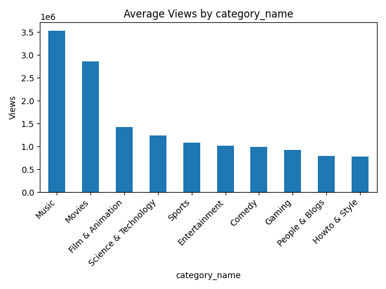
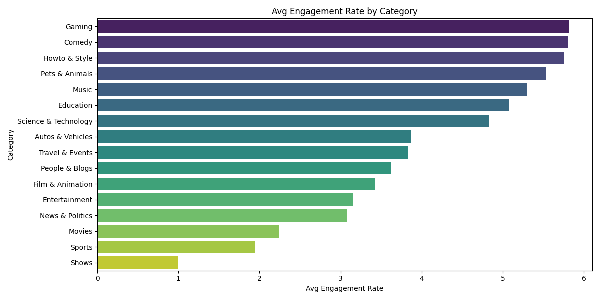
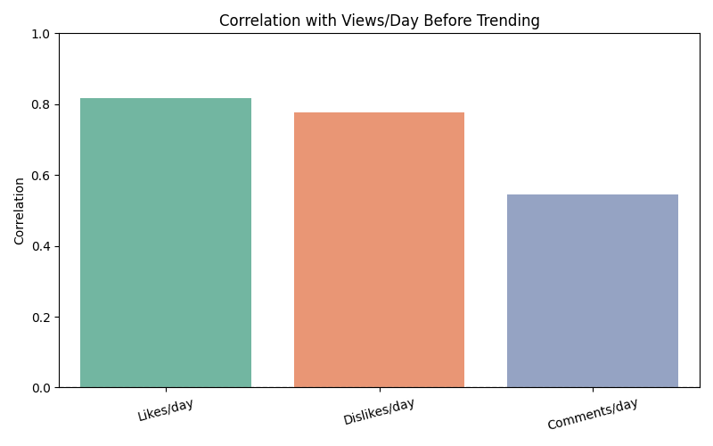
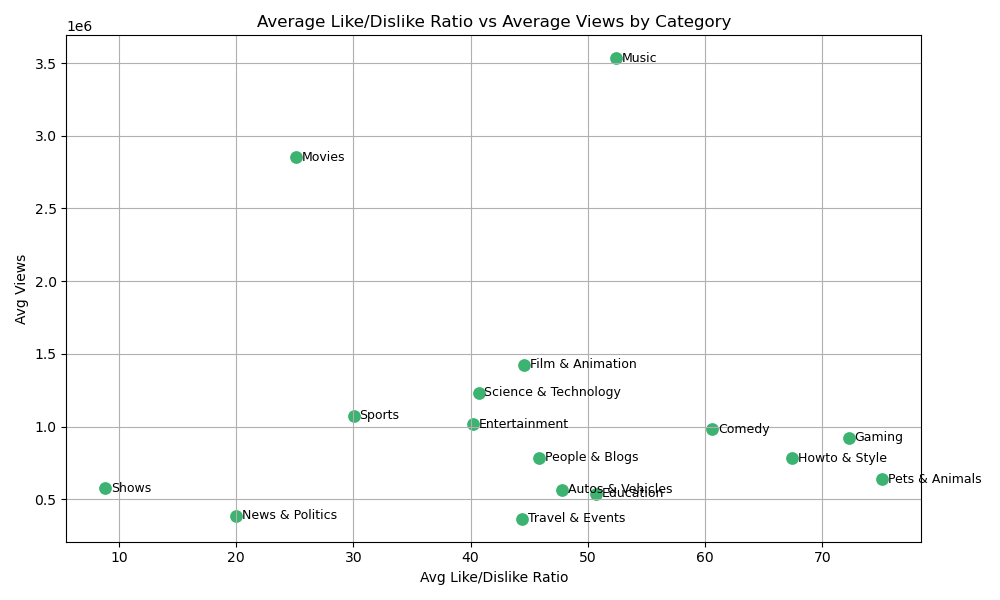
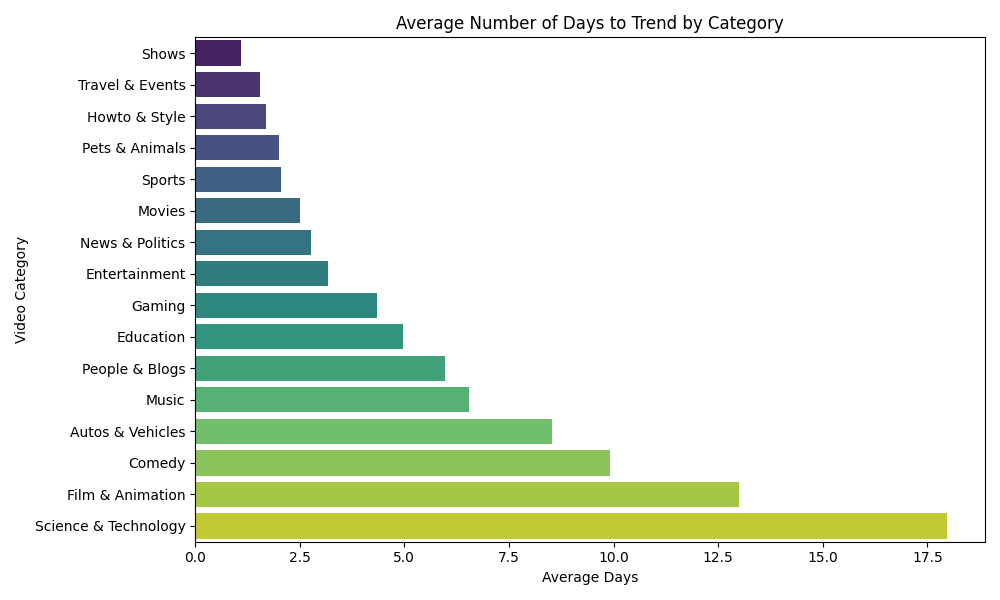
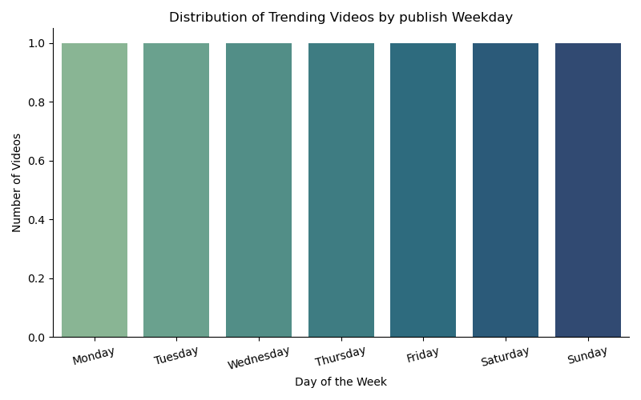
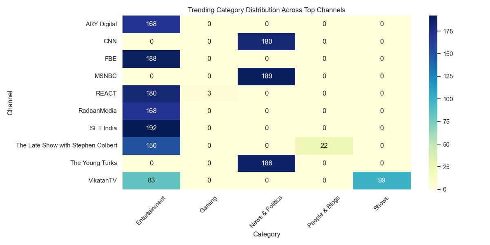
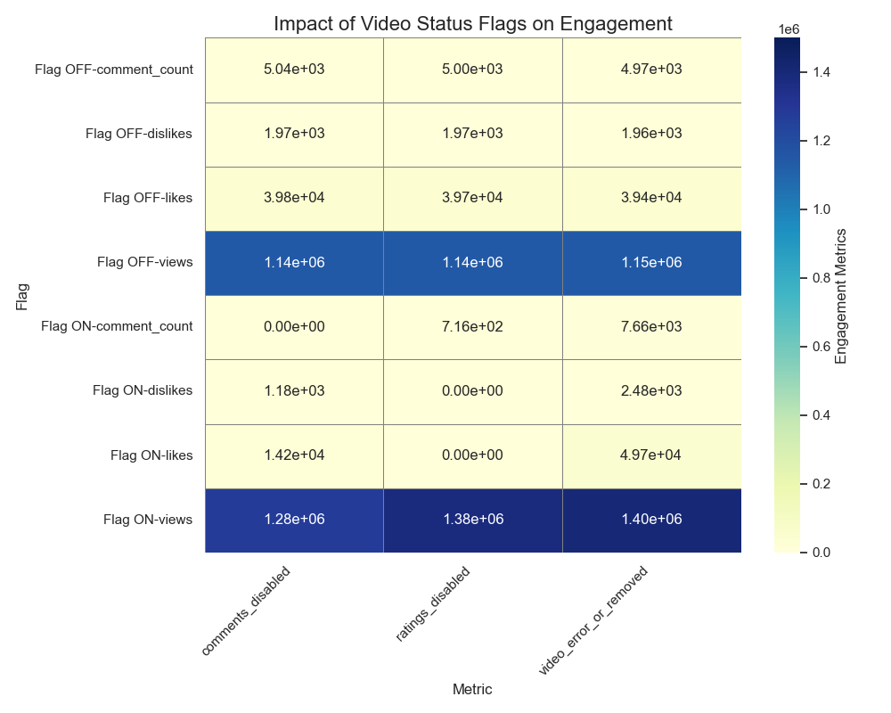

# 🇨🇦 YouTube Trending Analysis — Canada

## 🎯 Analysis Goals

In this analysis, we seek to answer the following questions:

1. **Category-Based Insights**
2. **Engagement & Popularity**
3. **Temporal Patterns**
4. **Content Metadata & Strategy**
5. **Creator & Channel Influence**
6. **Video Status & Restrictions**

---

## 1️⃣ Category-Based Insights

### 🔹 Which categories have the highest average views or trend most often?

  

> 🎵 **Music dominates the view counts**, but 🎬 **Movies are quickly catching up!**  
> *What’s your favorite category?*

### 🔹 How do viewer engagement metrics differ by category?

  

> Viewer engagement — measured by likes and comments relative to views — **varies greatly across categories**.  
> 🎮 **Gaming**, 😂 **Comedy**, and 🛠️ **Howto & Style** boast the **highest interaction rates**, reflecting active, loyal communities.  
> 📺 Meanwhile, categories like **Shows**, 🏟️ **Sports**, and 📰 **News** see **lower engagement**, likely due to more passive viewing habits.
---

## 2️⃣ Engagement & Popularity

### 🔹 What engagement metric best correlates with trending success?

  

> A strong correlation exists between **pre-trending engagement** and a video's daily view growth.  
> 👍 **Likes per day** are the **strongest predictor** of trending success — showing how powerful immediate positive feedback is.  
> 👎 Interestingly, **dislikes per day** also correlate highly — suggesting that **controversial content can fuel virality**.  
> 💬 Comment volume plays a smaller role in driving trends.
>
> ➡️ **Conclusion:** Rapid audience response — whether positive or negative — is a **stronger indicator of trending potential** than comment activity alone.
> 
### 🔹 Are higher like-to-dislike ratios linked to higher views?

  

> There is **no strong direct correlation** between a high like-to-dislike ratio and a high view count.  
> 🎵 For instance, **Music** attracts the highest average views despite having only a **moderate ratio**.  
> 🐶 On the other hand, **Gaming** and **Pets & Animals** enjoy **excellent ratios** but more **moderate viewership**.
>
> ❗ This suggests that while a **very low ratio** can be a negative signal, a **high ratio alone doesn't guarantee viral success**.
>
> ➡️ **Conclusion:** **Category popularity and content type** play a **more influential role** than like-to-dislike ratios in driving views.

### 🔹 Effect of disabled engagement

  

> In general, videos with **both comments and ratings enabled** show the **strongest and most balanced performance**.  
> ❌ **Disabling ratings** is the most detrimental configuration — it's associated with the **lowest average views and engagement**.
>
> ⚠️ Interestingly, a small group of videos with **both comments and ratings disabled** has the **highest average views**,  
> but these are likely **anomalies**, possibly driven by **external promotion or platform features**,  
> and **not a scalable or recommended strategy**.

---

## 3️⃣ Temporal Analysis

### 🔹 Average delay between publish time and trending date

  

> • 🚀 **Fast (< 2 days):** *Shows*, *Travel & Events*, *Howto & Style* — quick audience reaction.  
> • 📈 **Moderate (2–4 days):** *News*, *Entertainment*, *Gaming* — steady engagement.  
> • 🐢 **Slow (9–18 days):** *Comedy*, *Film*, *Science & Tech* — gradual traction.  
> • 🧪 **Outlier:** *Science & Tech* trends the slowest (~18 days).
>
> 🧠 **Key Takeaway:**  
> Fast-trending videos are often **viral or time-sensitive**,  
> while slow-trending ones are typically **niche or evergreen**, requiring **longer exposure** to gain traction.

### 🔹 Day-of-week effects

  

> **Most Active Days:**  
> 🔹 *Friday* (7,006)  
> 🔹 *Thursday* (5,945)  
> 🔹 *Monday* (5,861)
>
> **Least Active Days:**  
> 🔸 *Saturday* (5,239)  
> 🔸 *Sunday* (5,394)  
> 🔸 *Wednesday* (5,504)
>
> 📌 **Key Insight:**  
> Posting on **Thursday or Friday** may increase a video's **trending potential**,  
> likely due to **higher pre-weekend engagement**.

### 🔹 Monthly/seasonal variation

  

> 🔺 *Top Months:* **December**, **March**, **May** — high exposure, seasonal boosts.  
> 🔻 *Low Months:* **June**, **November**, **April** — fewer trending videos.  
> 
> 📌 **Tip:** Post in top months for better visibility.

---

## 4️⃣ Content Metadata & Strategy

### 🔹 Tag patterns in trending videos

  

> 🔁 **Common Tags:**  
> `funny`, `comedy`, `review` — span Entertainment, Gaming, Tech.
>
> 🎯 **Category-Specific:**  
> • *Autos:* `doug demuro`, `nissan`, `mods`  
> • *Education:* `scishow`, `grant thompson`  
> • *People & Blogs:* `joe rogan`, `podcast`  
> • *Pets:* `coyote peterson`, `aquarium`  
> • *Travel:* `mark wiens`, `street food`
>
> 🌍 **Regional Tags:**  
> • *Music:* strong **Punjabi** presence  
> • *Movies:* local titles like *Golak Bugni Bank Te Batua*  
> • *Shows:* dominated by **Tamil serials**
>
> 🔄 **Cross-Category Tags:**  
> `review`, `unboxing`, and `trailer` connect **Tech & Film** audiences.

---

## 5️⃣ Creator & Channel Influence

### 🔹Format & Category Consistency in Trending Channels

  

> 📌 **Category Focus:**  
> Most top channels stick to **1–2 categories**:  
> • *SET India*, *FBE* → **Entertainment**  
> • *CNN*, *MSNBC* → **News & Politics**
>
> 🔥 **Heatmap Insight:**  
> Channels show **strong category dominance**, with minor variation.
>
> 🎞️ **Format Patterns:**  
> Trending content often follows **repeatable formats** — daily news, serials, shows.
>
> ✅ **Conclusion:**  
> A **consistent niche & format** builds audience familiarity and boosts trending potential.

---

## 6️⃣ Video Status & Restrictions

### 🔹 Impact of `comments_disabled`, `ratings_disabled`, `video_error_or_removed`

  

> 🚫 **Controversial ≠ Low Visibility**
>
> Videos with **interactions disabled** (comments or ratings) still achieve **high view counts** — especially when they’re **time-sensitive or polarizing**.
>
> ⚠️ **Engagement drops**, but visibility remains — suggesting platform-driven virality or external sharing (e.g., news coverage).
>
> 🔍 **Removed videos** often peak in views **right before removal**, supporting the idea that **highly viral content is prone to moderation**, not necessarily bad content.
>
> ✅ **Takeaway:** Creators shouldn’t fear backlash if content is quality — **timing and topic matter more** than full interactivity.

---

## ✅ Conclusion

- **🎯 Categories:** Music & Entertainment lead in views; Gaming & Howto win on engagement.
- **📈 Engagement:** Early likes (even dislikes) are strong predictors of trending.
- **🕒 Timing:** Thursday–Friday posts and March/May/December see higher trending chances.
- **🏷️ Metadata:** Relevant tags, consistent formats, and strong titles boost visibility.
- **📺 Channels:** Top performers focus on 1–2 categories with repeatable content styles.
- **⚠️ Restrictions:** Disabled features or removals don’t stop virality — controversy can amplify reach.

> 📌 **Tip:** Focus, engage early, publish smart — even restricted content can trend if it resonates.

---

_Last updated: July 31, 2025_
