# 🇺🇸 YouTube Trending Analysis — United States

## 🎯 Analysis Goals

In this analysis, we seek to answer the following questions:

1. **Category-Based Insights**  
2. **Engagement & Popularity**  
3. **Temporal Patterns**  
4. **Content Metadata & Strategy**  
5. **Creator & Channel Influence**  
6. **Video Status & Restrictions**

---

## 1️⃣ Category-Based Insights

### 🔹 Which categories have the highest average views or trend most often?

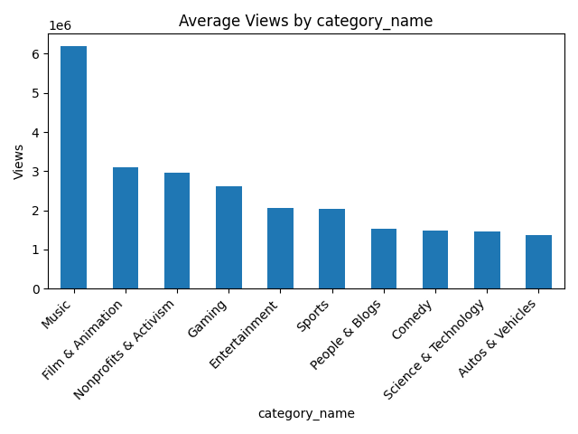

> 🎵 **Music dominates the view counts**, exceeding 6 million views on average.  
> This suggests Music is not only highly viewed but also frequently trending.

### 🔹 How do viewer engagement metrics differ by category?

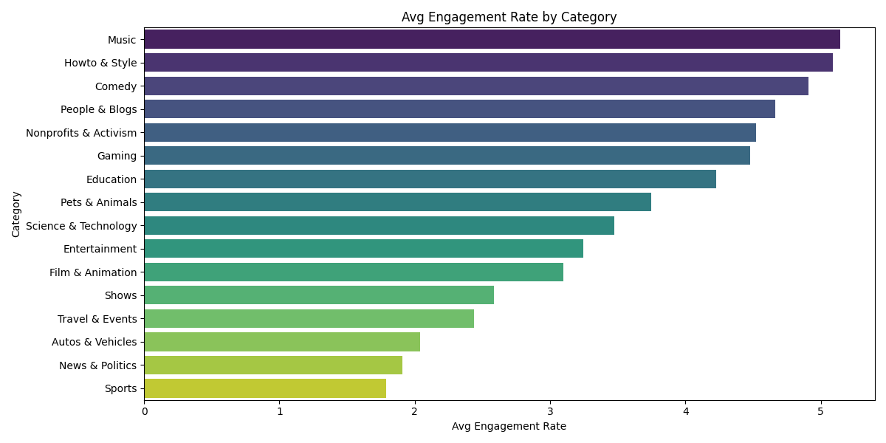

> Viewer engagement — measured by likes and comments relative to views — **varies widely across categories**.

> 🌟 **Music**, 👩‍🔧 **Howto & Style**, and 😂 **Comedy** lead in interaction rates, showing loyal audiences.

> 🏞️ *Sports*, 📰 *News & Politics*, and 🎮 *Autos & Vehicles* rank low, likely reflecting more passive consumption.

---

## 2️⃣ Engagement & Popularity

### 🔹 What engagement metric best correlates with trending success?

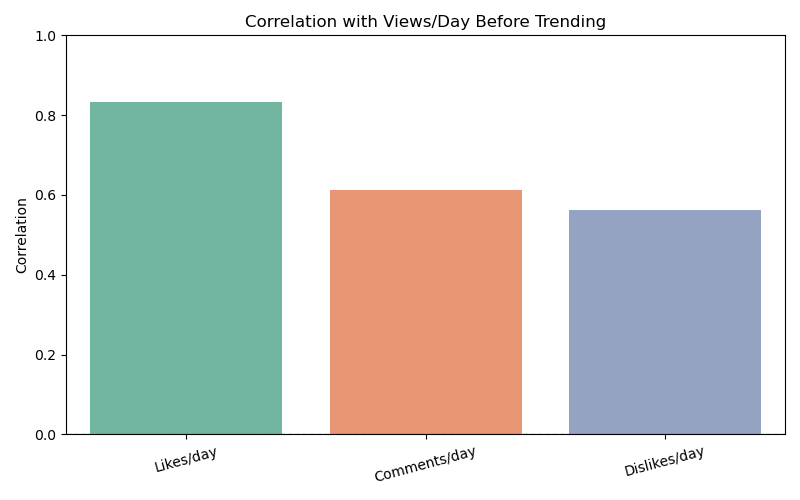

> 👍 **Likes/day** has the strongest correlation (~0.83) with views/day before trending.  
> 💬 **Comments/day** also shows a strong link (~0.61), suggesting value in discussion.  
> 👎 **Dislikes/day** is moderately predictive (~0.56), possibly signaling polarizing content.

➡️ **Conclusion:** **Positive reactions and community buzz** are better indicators of trending than dislikes alone.

### 🔹 Are higher like-to-dislike ratios linked to higher views?

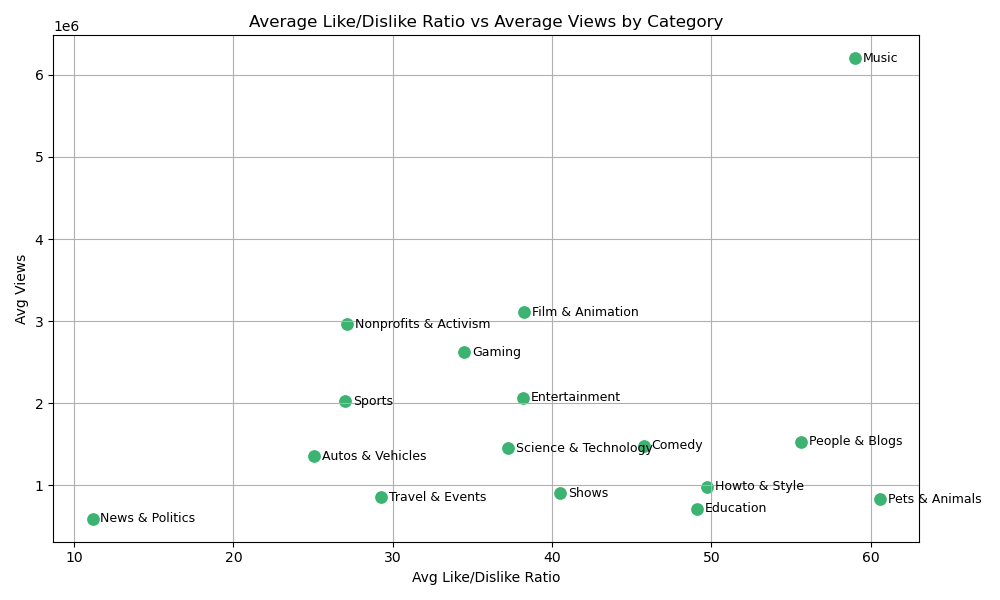

> ❌ No strong correlation between high like/dislike ratios and view count.

> 🎵 *Music* enjoys high views and a strong ratio, but *Pets & Animals* has the **highest ratio (~60)** with lower views.

> ⚠️ *News & Politics* has the lowest ratio (~12) and low views — a potential red flag.

✅ **Conclusion:** Sentiment is **not enough** — **category size and topic virality** have stronger influence.

### 🔹 Effect of disabled engagement

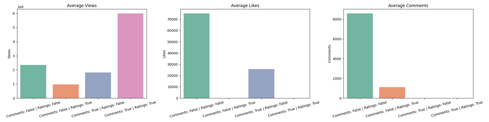

> ❌ Disabling **only ratings** leads to lowest performance (~0.9M views).  
> ❓ Surprisingly, **both-disabled** videos hit **~6M views** — likely **special cases** like trailers or major events.  
> ✅ All-enabled videos show **balanced success**: ~2.4M views, 75K likes, 8.5K comments.

✅ **Conclusion:** **Engagement boosts visibility**, but some videos break norms via external momentum.

---

## 3️⃣ Temporal Analysis

### 🔹 Average delay between publish time and trending date

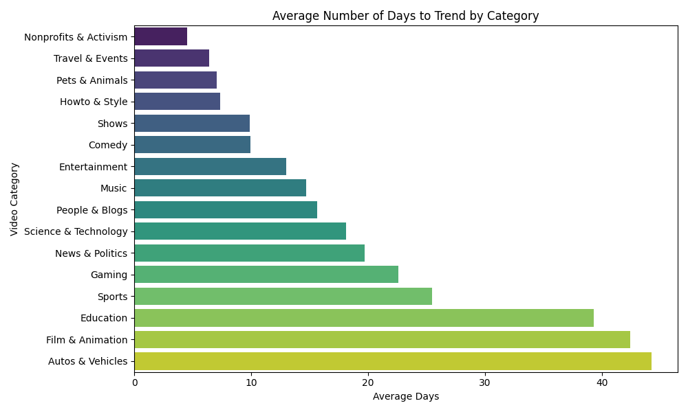

> ⏰ **Fast (4–7 days):** *Nonprofits*, *Travel*, *Pets & Animals*  
> ⏳ **Moderate (12–19 days):** *Entertainment*, *Music*, *News*  
> 🐢 **Slow (22–43 days):** *Gaming*, *Education*, *Film*, *Autos*

🧠 **Takeaway:** Timely or emotional content trends faster. **Evergreen topics** build slower traction.

### 🔹 Day-of-week effects

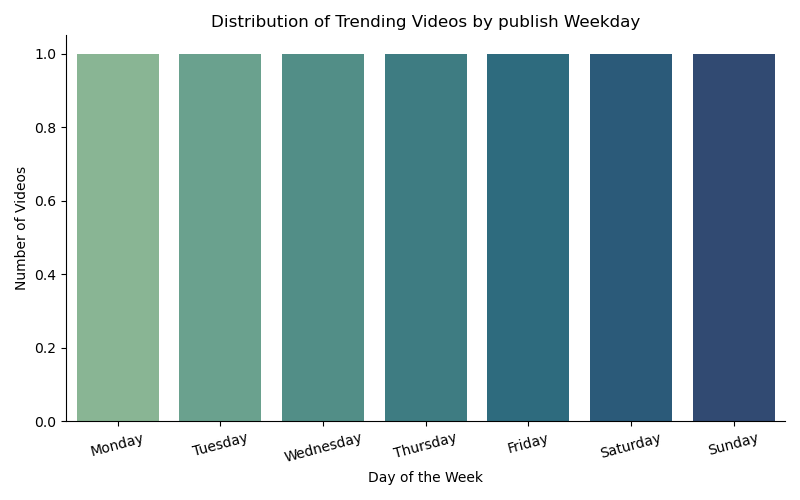

> **Most Active Days:**  
> 🔹 Friday (7,006)  
> 🔹 Thursday (5,945)  
> 🔹 Monday (5,861)

> **Least Active Days:**  
> 🔸 Saturday (5,239)  
> 🔸 Sunday (5,394)  
> 🔸 Wednesday (5,504)

📌 **Insight:** Thursdays & Fridays — best posting days for trending boost.

### 🔹 Monthly/seasonal variation

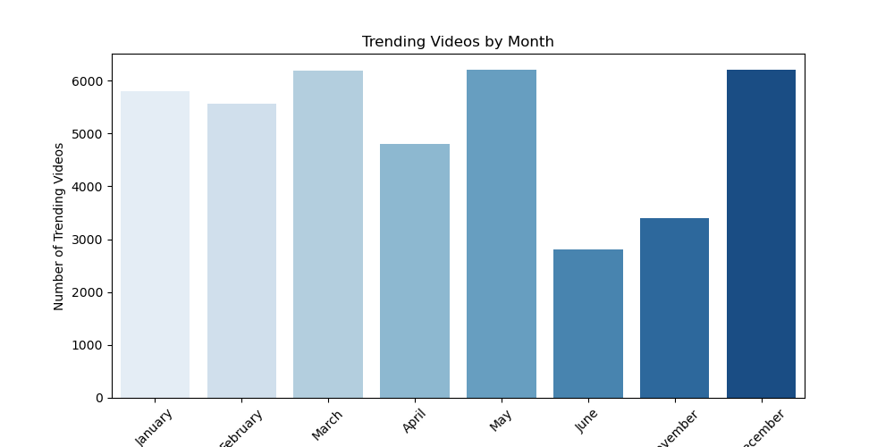

> 🔺 Peaks: December (6,182), March (6,175), May (6,166)  
> 🔻 Lows: June (2,800), November (3,391), April (4,781)

📌 **Tip:** Aim for holiday & spring months for visibility.

---

## 4️⃣ Content Metadata & Strategy

### 🔹 Tag patterns in trending videos

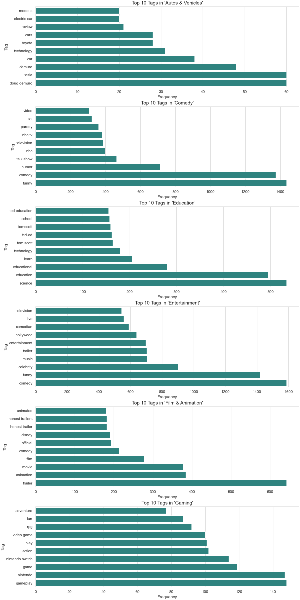

> 🔁 **Common Tags:** `comedy`, `television` — across *Comedy* & *Entertainment*

> 🔍 **Category-Specific:**  
> *Autos:* `doug demuro`, `toyota`  
> *Comedy:* `snl`, `humor`  
> *Education:* `ted ed`, `tom scott`  
> *Entertainment:* `celebrity`, `live`  
> *Film:* `trailer`, `disney`  
> *Gaming:* `gameplay`, `nintendo`

> ❌ No visible overlap between Film & Tech in this dataset.

---

## 5️⃣ Creator & Channel Influence

### 🔹 Format & Category Consistency in Trending Channels

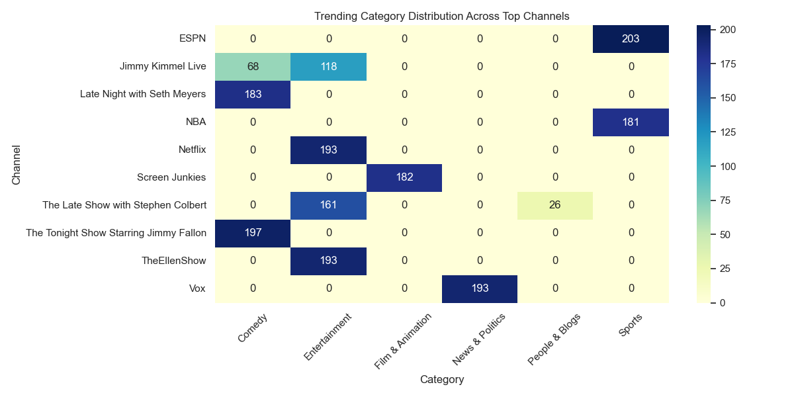

> 📌 **Niche Focus:**  
> *Netflix*, *TheEllenShow* → *Entertainment*  
> *Fallon*, *Seth Meyers* → *Comedy*  
> *ESPN*, *NBA* → *Sports*  
> *Vox* → *News*

> 🔥 **Insight:** Trending channels often lock into **1–2 categories**.  
> 🎬 **Format Patterns:** Talk shows, news clips, serial content → repeatable success.

✅ **Conclusion:** **Consistency breeds familiarity and trending potential**.

---

## 6️⃣ Video Status & Restrictions

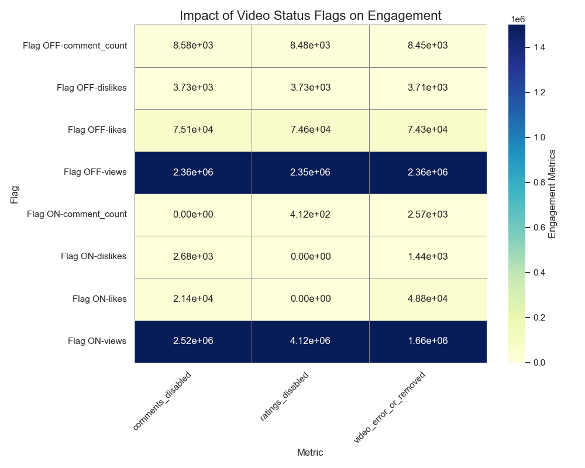

> 🚫 **Engagement Disabled ≠ Failure**  
> Ratings-disabled videos can still thrive: ~4.1M avg views vs ~2.3M baseline.

> ⚠️ **Engagement Drops, Views May Rise**  
> High-profile content (e.g., trailers) can trend **without interaction**.

> 📉 **Removed videos = poor performance** (~1.66M views avg)

✅ **Takeaway:** Don’t fear disabling features **if the content can stand on its own**.

---

## ✅ Conclusion

- **🎯 Categories:** Music leads in views; Howto, Comedy, and Music lead in engagement.  
- **📈 Engagement:** Likes & comments are top predictors of trend success.  
- **🕒 Timing:** Best to publish Thu/Fri, especially in Dec, May, or March.  
- **🏷️ Metadata:** Tags, serial formats, and strategic promotion help visibility.  
- **📺 Channels:** Trendsetters focus on 1–2 categories and consistent formats.  
- **⚠️ Restrictions:** Disabling engagement doesn’t stop virality — content quality matters more.

> 📌 **Tip:** Engage early, focus content, and publish smart. Even restricted videos can trend if the content hits the mark.

---

_Last updated: Aug 2, 2025_
